<picture>
  <source media="(prefers-color-scheme: dark)" srcset="./dark.svg">
  
</picture>

  
  
  
  

---

### 👋 About

Full Stack Developer and AI Enthusiast based in the Netherlands. Building modern web applications end to end — from React interfaces to Node.js services and infrastructure.

- 🎯 **Focus:** Focus on my goals
- 🎓 **Education:** DevEducation
- 📍 **Based in:** Groningen, Netherlands
- 🌐 **Portfolio:** [andriisavenko.dev](https://andriisavenko.dev)

---

### 🛠 Tech Stack

---

### 📊 Stats

  
  

